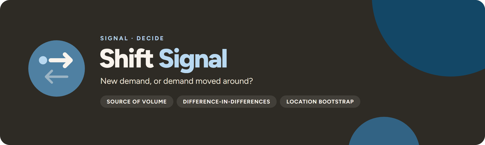

<p align="center">
  
</p>

<p align="center">
  <a href="https://github.com/UlrikErlingsen/cannibalization-analysis/actions"></a>
  <a href="https://github.com/UlrikErlingsen/signal-hub"></a>
  
  
  <a href="LICENSE"></a>
</p>

<p align="center"><strong>See where a launch's volume comes from, and whether the whole portfolio earns more.</strong></p>

**Shift Signal** helps restaurant, retail and product marketers judge whether a new menu item or product adds business or mostly takes it from what they already sell. It combines a source-of-volume planner for before launch with a test-versus-control comparison for after launch, and keeps contribution and uncertainty in view in both.

> Does a launch grow the portfolio, or move existing demand around?

Everything runs locally with open-source Python packages. There is no account, telemetry, external AI call, remote database, or built-in persistence.

## Read this first

> **A launch can sell well and still add little.** Shift Signal separates the launch item's own sales from what the portfolio as a whole gains, in units, revenue and contribution.

- **The planner is an accounting scenario, not a demand model.** You state how many units the launch will sell and what share will come from your own items. The app follows those units through your existing items and margins. It does not estimate demand, price elasticity, traffic or capacity, and changing a price does not change the volume you entered.
- **The historical comparison is difference-in-differences** across test locations that got the launch and control locations that did not, with a location bootstrap and a split-pre placebo. It is associational. It supports a causal reading only if untreated trends would have been parallel, locations are independent, and nothing else changed differently between the groups.
- **Net displacement is an aggregate contrast, not observed switching.** Incumbent gains and losses offset, so the rate can fall below 0% (a halo) or rise above 100% (wider decline or confounding). It is never clipped.
- **Cannibalization is not automatically bad.** Displacing low-margin units with a higher-margin launch can raise contribution.

## Scope

**Version 1.0 supports:**

- a source-of-volume planner for up to 100 incumbent items, with overlap weights, capacity-constrained allocation, a contribution bridge and a volume × cannibalization sensitivity grid;
- a historical launch comparison on a balanced daily or weekly panel with one common launch date, at least 4 locations per group and at least 4 periods either side;
- equal-location difference-in-differences for units, revenue and contribution, item by item and for the whole portfolio;
- 95% location-bootstrap percentile intervals, a split-pre placebo and explicit design warnings;
- restaurant-menu and product-portfolio wording and fictional demos for both;
- a ZIP evidence pack for each route.

**It does not:** estimate demand curves, price elasticities or individual customer switching; separate competitor switching from category growth with own-sales data; handle staggered launches, changing assortments, basket or complement effects, or a single location without controls; remove outliers or impute missing data; or approve a launch. Whether a concept deserves investment at all is **[Gate Signal](https://github.com/UlrikErlingsen/launch-decision-gate)**'s question, randomized tests belong in **[Experiment Signal](https://github.com/UlrikErlingsen/experiment-analysis)**, price evidence in **[Tag Signal](https://github.com/UlrikErlingsen/pricing-analysis)**, and measured preferences and switching in **[Choice Signal](https://github.com/UlrikErlingsen/conjoint-analysis)**.

## Try the demo in three minutes

1. Start the app. **Overview** opens on a fictional restaurant example: a new burger sells 850 units, 510 of them move from existing mains, and the menu adds 340 units.
2. Open **Launch planner**. Move the cannibalization slider and watch the source-of-volume flow, the contribution bridge and the sensitivity lines. Switch to **Product portfolio** for the coffee example.
3. Open **Launch evidence**. The fictional panel (12 test and 12 control locations, 24 weeks, launch on 2026-04-27) is analysed straight away. Read the four headline estimates with their intervals, then open **Study diagnostics and uncertainty** for the placebo and warnings.
4. Click **Download launch evidence pack** to export the ZIP.

The demo is deterministic synthetic data, generated with a known 60% (menu) or 70% (coffee) displacement share that the historical comparison recovers within its interval. It represents no real restaurant, retailer, product, course case or empirical finding.

## Data contract

Two UTF-8 CSV formats, comma or semicolon delimited, with decimal points. Limits: 1000 MB and 5,000,000 rows (date × location × item cells) locally, 100 items. Blanks are rejected, never read as zero. Templates for both are on the **Data guide** page.

**Launch planner:** one row per incumbent item in one comparable choice set. The launch itself is entered in the app.

| item | units | price | unit_cost | overlap |
|---|---|---|---|---|
| Classic burger | 1400 | 169 | 60 | 0.90 |
| House salad | 650 | 149 | 48 | 0.10 |

**Launch evidence:** one row per date × location × item, a complete panel.

| date | location | group | item | units | price | unit_cost |
|---|---|---|---|---|---|---|
| 2026-04-27 | test-01 | test | Smoky mushroom burger | 42 | 189 | 72 |
| 2026-04-27 | control-01 | control | Smoky mushroom burger | 0 | 189 | 72 |

The panel is rejected, with the reason shown, if rows are missing or duplicated, the calendar has gaps or is neither daily nor weekly, a location changes group, either group has fewer than 4 locations, there are fewer than 4 periods on either side of the launch, or the launch item sells before launch or in a control location.

See the [data guide](docs/data-guide.md).

## Methods

**Planner.** Displaced units `D = launch units × cannibalization share`. `D` is allocated across incumbents in proportion to units × overlap weight; an item never loses more than it sells, and any excess is redistributed. A scenario that needs more volume than eligible items sell is rejected, not capped. Contribution change `= Q_new(P_new − V_new) − Σ D_i(P_i − V_i) − launch cost`. A sensitivity grid varies launch volume ±25% and cannibalization from 0% to 100%.

**Historical comparison.**

1. **Audit:** the panel checks above.
2. **Estimate:** per location and item, mean units, revenue and contribution per period before and after launch; equal location weights within each group; item effect = test change − control change; scaled by test locations × post periods to a total. The launch cost is deducted once from portfolio contribution.
3. **Displacement:** net displaced incumbent units and their ratio to the launch item's units.
4. **Uncertainty:** 2,000 bootstrap draws (fixed seed) resampling whole locations within each group, so each location's items and periods stay together; 95% percentile intervals. The rate interval is withheld when launch volume is too sparse across draws.
5. **Placebo and warnings:** the pre-period split in two halves tests whether incumbent demand was already diverging. Warnings flag fewer than 10 locations per group, a placebo interval that excludes zero, negative counterfactuals, and rates below 0% or above 100%.

See [methods](docs/methods.md).

## Decision statuses

Shift Signal does not return a go/no-go status. It reads the contribution result in one of these ways:

- **Planner, adds contribution:** the scenario's contribution change after launch cost is above zero, under the stated assumptions.
- **Planner, does not add contribution:** the change is zero or negative under the stated assumptions.
- **Evidence, interval above zero:** the whole 95% contribution interval is positive, conditional on the comparison design and declared costs.
- **Evidence, interval below zero:** the whole interval is negative, on the same terms.
- **Evidence, unresolved:** the interval crosses zero; the data do not resolve whether the launch improved contribution.

The design warnings above sit beside every reading and are not overridden by a positive result.

## Exports

Each route downloads a ZIP evidence pack:

- `evidence.json`: app and version, analysis type, the source label (fictional demo or uploaded filename), every setting (launch inputs, currency, period, launch date, cost, bootstrap draws, seed, method), the SHA-256 fingerprint of the input table, the summary estimates, warnings, panel audit and placebo, and the research sources and limits;
- `inputs.csv`: the portfolio or panel exactly as analysed, including in-app table edits, up to 250,000 rows. A larger panel is not copied into the pack; `evidence.json` then records `input_rows`, an `inputs_note` and the input SHA-256, so keep the source file with the pack;
- `items.csv`: item-level displacement (planner) or item effects with intervals and counterfactual totals (evidence);
- `sensitivity.csv` (planner) or `series.csv` and `descriptive.csv` (evidence): the sensitivity grid, the per-location average series by group, and descriptive location-period statistics.

Up to 250,000 rows the pack contains your full input rows, so treat it like the source data. Exported CSV text that begins with `=`, `+`, `-`, `@`, a tab or a carriage return is prefixed with an apostrophe against spreadsheet-formula interpretation. The Data guide and Research pages also offer the CSV templates and the source list as JSON.

## Run locally

You need Python 3.10 or newer and a local copy of this folder.

**macOS:** double-click `run_app.command`. **Windows:** double-click `run_app.bat`.

The first launch creates a private `.venv` and downloads open-source dependencies. Later launches reuse it. Or use a terminal:

```bash
python3 -m venv .venv
source .venv/bin/activate  # Windows: .venv\Scripts\activate
python -m pip install -r requirements.txt
python -m streamlit run app.py
```

Then open the local address shown in the terminal. Shift Signal prefers local port 8596; the macOS launcher falls back to another free port if it is taken. Both launchers accept `SHIFTSIGNAL_PORT` and `SHIFTSIGNAL_MAX_UPLOAD_MB` (the upload limit in MB, default 1000), and the macOS launcher also accepts `SHIFTSIGNAL_NO_BROWSER=1`. The app itself never accepts more than 1000 MB, so the variable can lower the limit but not raise it. A 5,000,000-row panel (about 250 MB) reads in about 2 seconds and analyses in about 8 seconds with roughly 1.7 GB of peak memory on a desktop machine.

### Docker

```bash
docker build -t shiftsignal .
docker run --rm -p 8596:8596 shiftsignal
```

Then open http://127.0.0.1:8596. The container runs as a non-root user. The image sets `STREAMLIT_SERVER_MAX_UPLOAD_SIZE=1000`; pass `-e STREAMLIT_SERVER_MAX_UPLOAD_SIZE=200` (or any smaller value) to `docker run` to lower the upload limit for a hosted copy.

## Privacy

Uploaded files are processed in memory by the running Streamlit app; nothing is sent to an external service and nothing is saved to disk. Inside Signal Hub the app writes no files and makes no network calls; on any hosted deployment the operator is responsible for transport security, access control, logs and retention. See [PRIVACY.md](PRIVACY.md).

## No install? Give this file to an AI

[AI_ANALYST.md](AI_ANALYST.md) is a standalone analysis protocol for a capable AI assistant, with the same scope limits, calculations and honesty rules. The local app is the more private option: a cloud AI sees whatever you upload or paste.

## Development

```bash
python -m pip install -e ".[test]"
python -m pytest
python -m ruff check .
python -m build
```

The analysis core installs without Streamlit or Plotly; `pip install -e ".[ui]"` adds the app dependencies. Tests cover unit and money conservation in the planner, saturation and infeasibility, exact recovery of a planted difference-in-differences effect, panel validation, whole-location bootstrap resampling and reproducibility, unclipped halo and above-100% rates, spreadsheet-safe exports, every Streamlit page, and the Signal Hub contract (`shiftsignal.ui.render`, namespaced keys, Hub mode, no repo-root file reads).

## Where this fits in Signal

Shift Signal comes after **[Gate Signal](https://github.com/UlrikErlingsen/launch-decision-gate)** has decided a concept deserves investment, and asks where its volume will come from. Use **[Choice Signal](https://github.com/UlrikErlingsen/conjoint-analysis)** to estimate preferences and likely switching instead of assuming overlap weights, **[Tag Signal](https://github.com/UlrikErlingsen/pricing-analysis)** for the launch price, and **[Experiment Signal](https://github.com/UlrikErlingsen/experiment-analysis)** when you can randomize the launch across locations.

<!-- signal-suite:start (generated from signal-hub/apps.yaml by scripts/sync_readme_suite.py) -->
| Family | App | Asks |
|---|---|---|
| Brand | [Track Signal](https://github.com/UlrikErlingsen/brand-tracking) | Is the brand moving, or is the tracker just noisy? |
| Brand | [Position Signal](https://github.com/UlrikErlingsen/brand-positioning) | Where do brands sit relative to competitors? |
| Market | [Prospect Signal](https://github.com/UlrikErlingsen/b2b-prospecting) | Which Norwegian companies fit your ideal customer, and which first? |
| Market | [Listen Signal](https://github.com/UlrikErlingsen/media-listening) | Who is talking about the brand in Norwegian media, and in what tone? |
| Market | [Influence Signal](https://github.com/UlrikErlingsen/influencer-campaigns) | Which creators delivered, and was every post labelled properly? |
| Market | [Season Signal](https://github.com/UlrikErlingsen/marketing-calendar) | What does the Norwegian marketing year look like, worked backwards? |
| Market | [Adopt Signal](https://github.com/UlrikErlingsen/adoption-forecasting) | When will a new product be adopted? |
| Market | [Rival Signal](https://github.com/UlrikErlingsen/competitor-analysis) | Which rivals matter, and how could they respond? |
| Market | [Reach Signal](https://github.com/UlrikErlingsen/location-catchment-analysis) | Where could a new location reach, and how would it share demand with existing sites? |
| Customer | [Worth Signal](https://github.com/UlrikErlingsen/customer-value-analytics) | What are customers and relationships worth? |
| Customer | [Segment Signal](https://github.com/UlrikErlingsen/customer-segmentation) | Do customers form stable, useful groups? |
| Customer | [Trace Signal](https://github.com/UlrikErlingsen/journey-path-analysis) | How do logged customer journeys actually unfold? |
| Customer | [Blueprint Signal](https://github.com/UlrikErlingsen/service-blueprinting) | How is the customer experience actually delivered, and where do the handoffs fail? |
| Customer | [Recommend Signal](https://github.com/UlrikErlingsen/recommender-evaluation) | Which recommendation policy should be tested live? |
| Research | [Choice Signal](https://github.com/UlrikErlingsen/conjoint-analysis) | How do product attributes drive choice? |
| Research | [Driver Signal](https://github.com/UlrikErlingsen/survey-driver-analysis) | Which measured experiences move with satisfaction? |
| Research | [Measure Signal](https://github.com/UlrikErlingsen/measurement-validation) | Does a multi-item score have a defensible structure? |
| Research | [Text Signal](https://github.com/UlrikErlingsen/open-text-analysis) | What recurring patterns appear in open-ended responses? |
| Research | [Tag Signal](https://github.com/UlrikErlingsen/pricing-analysis) | What price range is supported, and how does profit move? |
| Research | [Learn Signal](https://github.com/UlrikErlingsen/research-prioritization) | Which uncertainty is worth paying to research before you decide? |
| Decide | [Experiment Signal](https://github.com/UlrikErlingsen/experiment-analysis) | Did the treatment cause a practically meaningful change? |
| Decide | [Gate Signal](https://github.com/UlrikErlingsen/launch-decision-gate) | Does a concept deserve the next investment? |
| Decide | **Shift Signal** (this app) | Does a launch grow the portfolio, or move existing demand around? |
| Decide | [Alloc Signal](https://github.com/UlrikErlingsen/marketing-mix-allocation) | Where should the next marketing budget go? |

All 24 apps run side by side in [Signal Hub](https://github.com/UlrikErlingsen/signal-hub), each opening with fictional demo data. Every repo carries the [`signal-suite`](https://github.com/topics/signal-suite) topic, and the suite is listed at [ulrikerlingsen.com](https://ulrikerlingsen.com). Freddo CRM is a separate product.
<!-- signal-suite:end -->

## References

- Bertrand, M., Duflo, E., & Mullainathan, S. (2004). How much should we trust differences-in-differences estimates? *Quarterly Journal of Economics, 119*(1), 249–275. https://doi.org/10.1162/003355304772839588
- Brodersen, K. H., Gallusser, F., Koehler, J., Remy, N., & Scott, S. L. (2015). Inferring causal impact using Bayesian structural time-series models. *Annals of Applied Statistics, 9*(1), 247–274. https://doi.org/10.1214/14-AOAS788
- Noone, B. M., & Cachia, G. (2020). Menu engineering re-engineered: Accounting for menu item substitutes in pricing and menu placement decisions. *International Journal of Hospitality Management, 87*, 102504. https://doi.org/10.1016/j.ijhm.2020.102504
- Train, K. E. (2009). *Discrete Choice Methods with Simulation* (2nd ed.). Cambridge University Press. https://eml.berkeley.edu/books/choice2.html
- van Heerde, H. J., Srinivasan, S., & Dekimpe, M. G. (2010). Estimating cannibalization rates for pioneering innovations. *Marketing Science, 29*(6), 1024–1039. https://doi.org/10.1287/mksc.1100.0575

The citations motivate the problem and the checks. None of them validates the planner's allocation rule or the app's warning thresholds, and the app does not implement the elasticity, choice or Bayesian time-series models these works describe.

## Originality and license

Shift Signal is an independent implementation based on public statistical literature and original synthetic examples. It does not reproduce lecture slides, institution-specific cases, teaching diagrams, exercises, exam questions, screenshots, tables or other institution-specific teaching material. See [sources and originality](docs/sources-and-originality.md).

The software and documentation are free under AGPL-3.0-or-later. The license covers this project's expression, not ownership of published statistical methods.

This application was developed with AI coding assistance and checked through source review, analytical fixtures, deterministic synthetic tests, automated app tests and visual inspection. Verify material decisions independently; no warranty is provided.

---

<p>
  
  <strong>Shift Signal</strong> is part of <a href="https://github.com/UlrikErlingsen/signal-hub"><strong>Signal</strong></a>, open marketing-evidence tools by <a href="https://ulrikerlingsen.com">Ulrik Erlingsen</a>.
</p>
